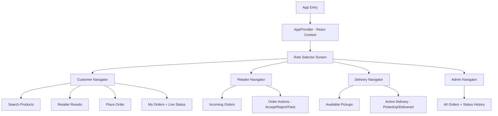

# NearFind — React Native (Expo) Implementation Plan

Build a working Android APK for a hyperlocal product discovery & delivery platform with 3 core roles + bonus admin panel.

## Decisions (confirmed)

| Decision | Choice |
|---|---|
| Framework | React Native with **Expo** (`expo prebuild` → Gradle APK) |
| State management | **React Context** — all in-memory, no backend |
| Role UX | **Single APK** with a role-selector home screen |
| Auto-cancel timeout | **60 seconds** (demo-friendly) |
| Bonus admin panel | **Yes**, as a 4th role option |
| Navigation | **React Navigation** (stack + bottom tabs) |
| UI style | Modern Material-inspired, green/teal accent palette |

---

## Architecture Overview



### State Shape (React Context)

```js
{
  products: [...],         // 5-10 seeded products
  retailers: [...],        // 2-3 seeded retailers with inventory
  orders: [
    {
      id, customerId, retailerId, productId, quantity,
      status,            // Placed|Accepted|Rejected|Packed|ReadyForPickup|PickedUp|Delivered|Cancelled
      deliveryPartnerId,
      statusHistory: [{ status, timestamp }],
      createdAt,
      timeoutTimer,      // reference for auto-cancel
    }
  ],
  notifications: [...]    // simple in-app notifications
}
```

---

## Project Structure

```
NearFind/
├── App.js                          # Entry: wraps AppProvider + NavigationContainer
├── app.json                        # Expo config
├── package.json
├── src/
│   ├── context/
│   │   └── AppContext.js           # Global state + actions (place order, accept, reject, etc.)
│   ├── data/
│   │   └── mockData.js             # Seed: retailers, products, inventory
│   ├── navigation/
│   │   ├── CustomerNavigator.js    # Stack: Search → Results → Order → MyOrders
│   │   ├── RetailerNavigator.js    # Stack: IncomingOrders → OrderDetail
│   │   ├── DeliveryNavigator.js    # Stack: AvailableOrders → ActiveDelivery
│   │   └── AdminNavigator.js       # Single screen: all orders list
│   ├── screens/
│   │   ├── RoleSelectorScreen.js
│   │   ├── customer/
│   │   │   ├── SearchScreen.js
│   │   │   ├── RetailerResultsScreen.js
│   │   │   ├── PlaceOrderScreen.js
│   │   │   └── MyOrdersScreen.js
│   │   ├── retailer/
│   │   │   ├── IncomingOrdersScreen.js
│   │   │   └── OrderActionsScreen.js
│   │   ├── delivery/
│   │   │   ├── AvailableOrdersScreen.js
│   │   │   └── ActiveDeliveryScreen.js
│   │   └── admin/
│   │       └── AdminPanelScreen.js
│   ├── components/
│   │   ├── OrderCard.js
│   │   ├── ProductCard.js
│   │   ├── StatusBadge.js
│   │   ├── NotificationBanner.js
│   │   └── EmptyState.js
│   └── theme/
│       └── colors.js               # Color palette + spacing constants
```

---

## Proposed Changes — Screen by Screen

### [NEW] Setup & Config

#### [NEW] App.js
- Wrap everything in `AppProvider` (Context) and `NavigationContainer`
- Root navigator switches between RoleSelector and role-specific navigators

#### [NEW] app.json
- Expo config with app name "NearFind", Android package `com.nearfind.app`

---

### [NEW] State Management — `src/context/AppContext.js`

Core actions exposed via context:
- `searchProducts(query)` — filter products by name
- `getRetailersForProduct(productId)` — return retailers with stock/price
- `placeOrder(customerId, retailerId, productId, qty)` — create order, start 60s auto-cancel timer
- `acceptOrder(orderId)` — retailer accepts, clears timeout
- `rejectOrder(orderId)` — retailer rejects, notifies customer
- `updateOrderStatus(orderId, newStatus)` — retailer: Packed/ReadyForPickup; delivery: PickedUp/Delivered
- `acceptDelivery(orderId, deliveryPartnerId)` — delivery partner claims an order
- `getOrdersByRole(role, userId)` — filtered view per role
- Auto-cancel logic: `setTimeout` on order creation, cleared on accept/reject

---

### [NEW] Mock Data — `src/data/mockData.js`

**Retailers (3):**
| Name | Address |
|---|---|
| Sharma Kirana Store | MG Road, Sector 5 |
| Quick Mart | Station Road, Block B |
| Daily Needs Express | Lake View Colony |

**Products (8):**
Maggi Noodles, Amul Butter, Tata Salt, Parle-G Biscuits, Surf Excel, Dairy Milk Chocolate, Aashirvaad Atta, Red Label Tea

**Inventory:** Each retailer carries 5-6 products at different prices/stock levels. Quick Mart has Maggi as "out of stock" (stock: 0) to match the example walkthrough.

---

### [NEW] Screens

#### RoleSelectorScreen
- 4 large tappable cards: Customer, Retailer, Delivery Partner, Admin
- Each card has an icon, label, and short description
- Tapping navigates to that role's navigator

#### Customer Screens
1. **SearchScreen** — search bar + product list (filtered in real-time). Tap a product → RetailerResults
2. **RetailerResultsScreen** — shows 2-3 retailers with price & stock. Out-of-stock retailers shown greyed out with "Unavailable" badge (not hidden). Tap an in-stock retailer → PlaceOrder
3. **PlaceOrderScreen** — quantity picker, order summary, "Place Order" button. Validates quantity ≤ stock
4. **MyOrdersScreen** — list of customer's orders with live status badges that update in real-time. Shows notifications for auto-cancel/rejection

#### Retailer Screens
1. **IncomingOrdersScreen** — list of orders for this retailer (Placed/Accepted/Packed). New orders highlighted. Countdown timer visible for pending orders
2. **OrderActionsScreen** — Accept/Reject buttons for Placed orders. Pack/ReadyForPickup buttons for Accepted orders

#### Delivery Screens
1. **AvailableOrdersScreen** — orders with status "ReadyForPickup" and no assigned delivery partner
2. **ActiveDeliveryScreen** — accepted delivery with "Mark Picked Up" / "Mark Delivered" buttons, shows retailer & customer info

#### Admin Screen
- **AdminPanelScreen** — flat list of ALL orders system-wide, each showing full status history with timestamps

---

### [NEW] Components

| Component | Purpose |
|---|---|
| `OrderCard` | Reusable order summary card (product, retailer, status badge, timestamp) |
| `ProductCard` | Product display with image placeholder, name, category |
| `StatusBadge` | Colored pill showing order status (green=delivered, yellow=in-progress, red=cancelled) |
| `NotificationBanner` | Slide-down notification for events (order cancelled, rejected, etc.) |
| `EmptyState` | "No orders yet" / "No available deliveries" placeholder |

---

## Edge Cases Handling

| Edge Case | Implementation |
|---|---|
| **Retailer timeout** | 60s `setTimeout` on order creation. If not accepted/rejected → auto-set status to `Cancelled`, push notification to customer |
| **Out of stock** | Retailer shown in results but greyed out with "Out of Stock" label. Order button disabled |
| **Order rejected** | Status → `Rejected`, customer notified, order card shows red badge |
| **No delivery partner** | After 120s in "ReadyForPickup" with no delivery partner → show warning notification to retailer. Order stays available (doesn't auto-cancel since it's already packed) |

---

## Theme & Colors

```js
const colors = {
  primary: '#0D9488',       // Teal
  primaryDark: '#0F766E',
  accent: '#F59E0B',        // Amber
  background: '#F8FAFC',
  surface: '#FFFFFF',
  text: '#1E293B',
  textSecondary: '#64748B',
  success: '#22C55E',
  warning: '#F59E0B',
  error: '#EF4444',
  cancelled: '#94A3B8',
};
```

---

## APK Build Strategy

1. Initialize Expo project with `npx create-expo-app`
2. Develop and test with `npx expo start` (Expo Go / dev client)
3. Run `npx expo prebuild --platform android` to generate native Android project
4. Build APK with `cd android && ./gradlew assembleRelease`
5. APK output at `android/app/build/outputs/apk/release/app-release.apk`

---

## Verification Plan

### Automated Tests
- Run `npx expo start` to verify app loads without crashes
- Test on Android emulator via Android Studio

### Manual Verification (End-to-End Walkthrough)
1. Open app → select Customer → search "Maggi" → see Sharma Kirana (in stock) and Quick Mart (out of stock, greyed)
2. Order 2 Maggi from Sharma Kirana → status shows "Placed"
3. Switch to Retailer role → see incoming order → Accept → Pack → Ready for Pickup
4. Switch to Delivery role → see available order → Accept → Mark Picked Up → Mark Delivered
5. Switch back to Customer → status shows "Delivered"
6. Test timeout: Place order, don't accept as retailer, wait 60s → verify auto-cancel
7. Test rejection: Place order, reject as retailer → verify customer notification
8. Open Admin panel → verify all orders with full history visible
9. Build APK and install on emulator to confirm standalone operation
